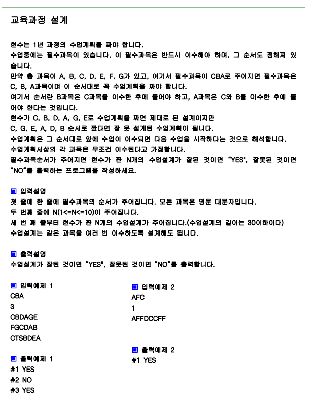

# 문제



# 풀이

```python
import sys
from collections import deque
sys.stdin=open("input.txt","rt")

need=input()
n=int(input())
for i in range(n):
    plan=input()
    dq=deque(need)
    for x in plan:
        if x in dq:
            if x != dq.popleft():
                print("#%d NO" %(i+1))
                break
    else:
        if len(dq) == 0:
            print("#%d YES" %(i+1))
        else:
            print("#%d NO" %(i+1))
        

```

# 결과

```
#1 YES
#2 NO
#3 YES
```

으로 정상 출력됩니다.
