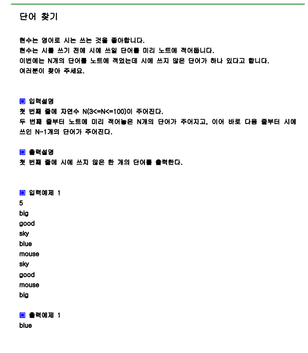

# 문제



# 풀이

```python
import sys
sys.stdin=open("input.txt","rt")

n=int(input())
p=dict()
for i in range(n):
    word=input()
    p[word]=1

for i in range(n-1):
    word=input()
    p[word]=0


for key, val in p.items():
    if val==1:
        print(key)
        break
    

```

# 결과

blue 으로 정상 출력됩니다.
