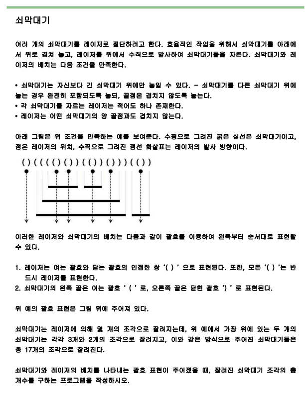
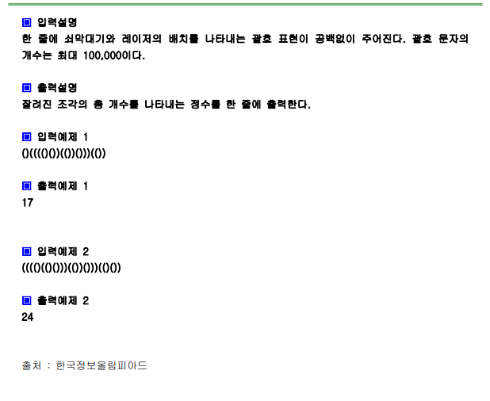

# 문제






# 풀이

```python
import sys
sys.stdin=open("input.txt","rt")

s=input()
stack=[]
cnt=0

for i in range(len(s)):
    if s[i] =='(':
        stack.append(s[i])
    else:
        stack.pop()
        if s[i-1] == '(':
            cnt+=len(stack)
        else:
            cnt+=1
            
print(cnt)


```

# 결과

17으로 정상 출력됩니다.
