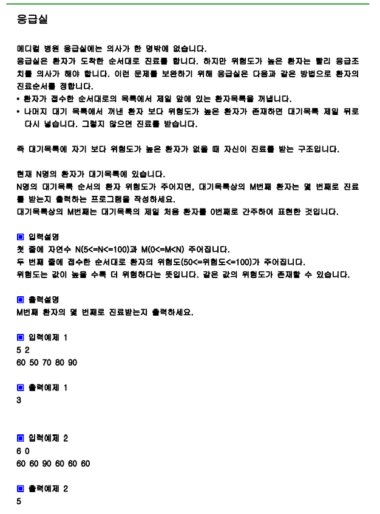

# 문제



# 풀이

```python
import sys
from collections import deque
sys.stdin=open("input.txt","rt")

n, m=map(int,input().split())
Q=[(pos,val) for pos, val in enumerate(list(map(int,input().split())))]
#Q=list(enumerate(map(int,input().split())))

Q=deque(Q)
cnt=0
while True:
    cur=Q.popleft()
    if any(cur[1]<x[1] for x in Q): #any 모든 경우의 수 비교 
        Q.append(cur)
    else:
        cnt+=1
        if cur[0]==m:
            break
print(cnt)

```

# 결과

3으로 정상 출력됩니다.
