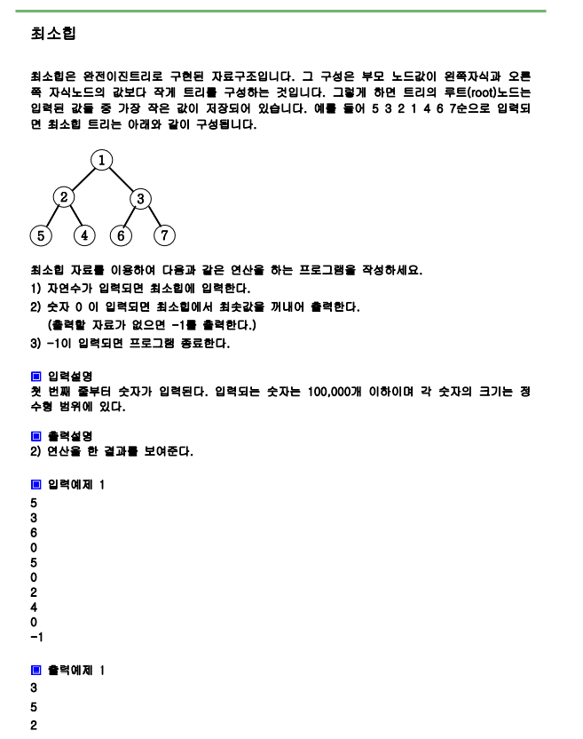

# 문제



# 풀이

```python
import sys
import heapq as hq
sys.stdin=open("input.txt","rt")
a=[]
while True:
    n=int(input())
    if n==-1:
        break
    if n==0:
        if len(a)==0:
            print(-1)
        else:
            print(hq.heappop(a))
    else:
        hq.heappush(a, n)
        


```

# 결과

```
3
5
2
```

으로 정상 출력됩니다.
