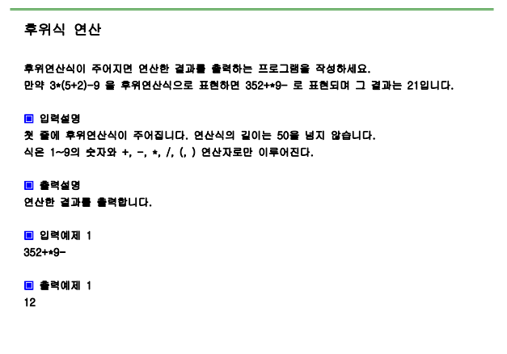

# 문제



# 풀이

```python
import sys
#sys.stdin=open("input.txt","rt")

s=input()

stack=[]

for x in s:
    if x.isdecimal():
        stack.append(x)
    elif x == '+':
        a=int(stack.pop())
        b=int(stack.pop())
        c=b+a
        str(c)
        stack.append(c)
    elif x== '-':
        a=int(stack.pop())
        b=int(stack.pop())
        c=b-a
        str(c)
        stack.append(c)
    elif x== '*':
        a=int(stack.pop())
        b=int(stack.pop())
        c=b*a
        str(c)
        stack.append(c)
    elif x=='/':
        a=int(stack.pop())
        b=int(stack.pop())
        c=b/c
        str(c)
        stack.append(c)
    
print(stack[0])

```

# 결과

12으로 정상 출력됩니다.
