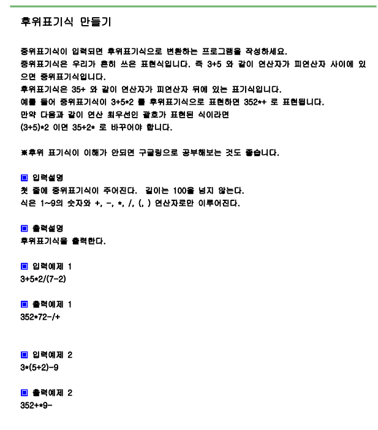

# 문제



# 풀이

```python
import sys
sys.stdin=open("input.txt","rt")

a=input()
stack=[]

res=''

for x in a:
    if x.isdecimal(): #10진수 확인 함수
        res+=x
    else:
        if x=='(':
            stack.append(x)
        elif x =='*' or x=='/':
            while stack and (stack[-1]=='*' or stack[-1]=='/'):
                res+=stack.pop()
            stack.append(x)
        elif x=='+' or x=='-':
            while stack and stack[-1] !='(':
                res+=stack.pop()
            stack.append(x)
        elif x==')':
            while stack and stack[-1] !='(':
                res+=stack.pop()
            stack.pop()
while stack:
    res+=stack.pop()
print(res)
    


```

# 결과

```
352+*9-
```

으로 정상 출력됩니다.
